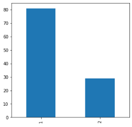

# Loan-Approval-Prediction-without-Gender-Biasing


### Import the required libraries

```python
import pandas as pd
import numpy as np
import seaborn as sns
import matplotlib.pyplot as plt
```

### Opening the German Credit Score dataset

```python
df = pd.read_excel('German_Credit_Score_Gender.xlsx')
df=df.drop(['Unnamed: 21'],axis=1)
```

### Data-Preprocessing step - Rename the columns for our convience

```python
df.rename(columns={'Status of existing checking account':'Status'},inplace=True)
df.rename(columns={'Duration in months':'Months'},inplace=True)
df.rename(columns={'Installment rate in percentage of disposable income':'Installment rate of income'},inplace=True)
df.rename(columns={'Number of existing credits at this bank':'Number of existing credits'},inplace=True)
df.rename(columns={'Number of people being liable to provide maintenance for':'Liable to provide maintenance for'},inplace=True)
df.rename(columns={'Personal status and sex':'Gender'},inplace=True)
df.rename(columns={'?':'ClassLabel'},inplace=True)
```

```python
df_new = pd.read_excel('German_Credit_Score_Gender.xlsx')
df_new = df_new.drop(['Unnamed: 21'],axis=1)
```

```python
df_new.rename(columns={'Status of existing checking account':'Status'},inplace=True)
df_new.rename(columns={'Duration in months':'Months'},inplace=True)
df_new.rename(columns={'Installment rate in percentage of disposable income':'Installment rate of income'},inplace=True)
df_new.rename(columns={'Number of existing credits at this bank':'Number of existing credits'},inplace=True)
df_new.rename(columns={'Number of people being liable to provide maintenance for':'Liable to provide maintenance for'},inplace=True)
df_new.rename(columns={'Personal status and sex':'Gender'},inplace=True)
df_new.rename(columns={'?':'ClassLabel'},inplace=True)
```

```python
from sklearn.model_selection import train_test_split
```

```python
import warnings
warnings.filterwarnings("ignore", category=FutureWarning)
```

```python
from sklearn.preprocessing import LabelEncoder
LE = LabelEncoder()
```

### Features to perform Decision Tree Classifier while excluding demographics

```python
feature_new = df.drop(['Gender', 'Age in years', 'Job', 'Housing','Telephone', 'Present employee since', 'Property', 'foreign worker'],axis =1)
feature_new['Credit History'] = LE.fit_transform(feature_new['Credit History'])
feature_new['Credit Amount'] = LE.fit_transform(feature_new['Credit Amount'])
feature_new['Other debtors / guarantors'] = LE.fit_transform(feature_new['Other debtors / guarantors'])
feature_new['Number of existing credits'] = LE.fit_transform(feature_new['Number of existing credits'])
feature_new['Status'] = LE.fit_transform(feature_new['Status'])
feature_new['Months'] = LE.fit_transform(feature_new['Months'])
feature_new['Purpose'] = LE.fit_transform(feature_new['Purpose'])
feature_new['Saving Account/Bonds'] = LE.fit_transform(feature_new['Saving Account/Bonds'])
feature_new['Installment rate of income'] = LE.fit_transform(feature_new['Installment rate of income'])
feature_new['Present residence since'] = LE.fit_transform(feature_new['Present residence since'])
feature_new['Other installment plans'] = LE.fit_transform(feature_new['Other installment plans'])
feature_new['Liable to provide maintenance for'] = LE.fit_transform(feature_new['Liable to provide maintenance for'])
```

```python
features_new_cols = ['Status', 'Months', 'Credit History', 'Purpose', 'Credit Amount', 'Saving Account/Bonds', 'Installment rate of income', 'Other debtors / guarantors', 'Present residence since', 'Other installment plans', 'Number of existing credits', 'Liable to provide maintenance for']
Xd = feature_new[features_new_cols]
yd = feature_new.ClassLabel
Xd_train, Xd_test, yd_train, yd_test = train_test_split(Xd,yd,test_size = 0.25, random_state = 0)
```

### Import Decision Tree Classifier

```python
from sklearn.tree import DecisionTreeClassifier
dtc = DecisionTreeClassifier()
yd = dtc.fit(Xd_test, yd_test)
yd_pred=yd.predict(Xd_test)
```

```python
from sklearn.model_selection import cross_val_score
scores = cross_val_score(yd, Xd_test, yd_test)
print(scores)
```

#### Output

```python
[0.67857143 0.66666667 0.68292683]
```

```python
ClassLabel_Classifier_new = pd.DataFrame(yd_pred)

df1_new = pd.concat([df_new, ClassLabel_Classifier_new], axis=1, join='inner')

df1_new.columns.values[21] = "ClassLabel1"
```

```python
df1_new
```

|     | Status | Months | Credit History | Purpose | Credit Amount | Saving Account/Bonds | Present employee since | Installment rate of income | Gender | Other debtors / guarantors | ... | Age in years | Other installment plans | Housing | Number of existing credits | Job  | Liable to provide maintenance for | Telephone | foreign worker | ClassLabel | ClassLabel1 |
| --- | ------ | ------ | -------------- | ------- | ------------- | -------------------- | ---------------------- | -------------------------- | ------ | -------------------------- | --- | ------------ | ----------------------- | ------- | -------------------------- | ---- | --------------------------------- | --------- | -------------- | ---------- | ----------- |
| 0   | A11    | 6      | A34            | A43     | 1169          | A65                  | A75                    | 4                          | Male   | A101                       | ... | 67           | A143                    | A152    | 2                          | A173 | 1                                 | A192      | A201           | 1          | 1           |
| ... | ...    | ...    | ...            | ...     | ...           | ...                  | ...                    | ...                        | ...    | ...                        | ... | ...          | ...                     | ...     | ...                        | ...  | ...                               | ...       | ...            | ...        | ...         |
| 249 | A14    | 18     | A32            | A43     | 433           | A61                  | A71                    | 3                          | Female | A102                       | ... | 22           | A143                    | A151    | 1                          | A173 | 1                                 | A191      | A201           | 2          | 1           |

250 rows × 22 columns

### Features to perform logistic regression on fair features

```python
features = df.drop(['Status','Months','Purpose','Saving Account/Bonds','Present employee since','Installment rate of income','Gender','Present residence since','Property','Age in years','Other installment plans','Housing','Job','Liable to provide maintenance for','Telephone','foreign worker'],axis=1)
features['Credit History'] = LE.fit_transform(features['Credit History'])
features['Credit Amount'] = LE.fit_transform(features['Credit Amount'])
features['Other debtors / guarantors'] = LE.fit_transform(features['Other debtors / guarantors'])
features['Number of existing credits'] = LE.fit_transform(features['Number of existing credits'])
```

```python
feature_cols = ['Credit History', 'Credit Amount', 'Other debtors / guarantors', 'Number of existing credits']
X = features[feature_cols] # Features
y = features.ClassLabel
X_train,X_test,y_train,y_test=train_test_split(X,y,test_size=0.25,random_state=0)
```

### Import the class

```python
from sklearn.linear_model import LogisticRegression
```

### Instantiate the model (using the default parameters)

```python
logreg = LogisticRegression()
```

### Fit the model with data

```python
y = logreg.fit(X_test,y_test)

y_pred=y.predict(X_test)
y_pred_prob=y.predict_proba(X)

ClassLabel_Classifier = pd.DataFrame(y_pred)
Predictions = pd.DataFrame(y_pred_prob)

df1 = pd.concat([df, ClassLabel_Classifier, Predictions], axis=1, join='inner')
```

```python
from sklearn.model_selection import cross_val_score
scores_linear = cross_val_score(yd, Xd_test, yd_test)
print(scores_linear)
```

### Output

[0.66666667 0.71428571 0.68292683]

```python
df1.rename(columns={0: 'ClassLabel_Predicted'}, inplace=True)
df1.columns.values[22] = "Prediction1"
df1.columns.values[23] = "Prediction2"
df1.head()
```

|     | Status | Months | Credit History | Purpose | Credit Amount | Saving Account/Bonds | Present employee since | Installment rate of income | Gender | Other debtors / guarantors | ... | Housing | Number of existing credits | Job  | Liable to provide maintenance for | Telephone | foreign worker | ClassLabel | ClassLabel_Predicted | Prediction1 | Prediction2 |
| --- | ------ | ------ | -------------- | ------- | ------------- | -------------------- | ---------------------- | -------------------------- | ------ | -------------------------- | --- | ------- | -------------------------- | ---- | --------------------------------- | --------- | -------------- | ---------- | -------------------- | ----------- | ----------- |
| 0   | A11    | 6      | A34            | A43     | 1169          | A65                  | A75                    | 4                          | Male   | A101                       | ... | A152    | 2                          | A173 | 1                                 | A192      | A201           | 1          | 1                    | 0.842740    | 0.157260    |
| ... | ...    | ...    | ...            | ...     | ...           | ...                  | ...                    | ...                        | ...    | ...                        | ... | ...     | ...                        | ...  | ...                               | ...       | ...            | ...        | ...                  | ...         | ...         |
| 4   | A11    | 24     | A33            | A40     | 4870          | A61                  | A73                    | 3                          | Male   | A101                       | ... | A153    | 2                          | A173 | 2                                 | A191      | A201           | 2          | 1                    | 0.697538    | 0.302462    |

### Splitting the table based on gender for matching process

```python
Male=df1[df1['Gender'] == 'Male']
Female=df1[df1['Gender'] == 'Female']
Male
```

### Output

|     | Status | Months | Credit History | Purpose | Credit Amount | Saving Account/Bonds | Present employee since | Installment rate of income | Gender | Other debtors / guarantors | ... | Housing | Number of existing credits | Job  | Liable to provide maintenance for | Telephone | foreign worker | ClassLabel | ClassLabel_Predicted | Prediction1 | Prediction2 |
| --- | ------ | ------ | -------------- | ------- | ------------- | -------------------- | ---------------------- | -------------------------- | ------ | -------------------------- | --- | ------- | -------------------------- | ---- | --------------------------------- | --------- | -------------- | ---------- | -------------------- | ----------- | ----------- |
| 0   | A11    | 6      | A34            | A43     | 1169          | A65                  | A75                    | 4                          | Male   | A101                       | ... | A152    | 2                          | A173 | 1                                 | A192      | A201           | 1          | 1                    | 0.842740    | 0.157260    |
| ... | ...    | ...    | ...            | ...     | ...           | ...                  | ...                    | ...                        | ...    | ...                        | ... | ...     | ...                        | ...  | ...                               | ...       | ...            | ...        | ...                  | ...         | ...         |
| 248 | A13    | 24     | A32            | A42     | 1925          | A61                  | A73                    | 2                          | Male   | A101                       | ... | A152    | 1                          | A173 | 1                                 | A191      | A201           | 1          | 1                    | 0.692905    | 0.307095    |

```python
Maled_new=df1_new[df1_new['Gender'] == 'Male']
Femaled_new=df1_new[df1_new['Gender'] == 'Female']
```

```python
del new_male
del new_female
```

```python
new_female
```

```python
new_male
```

```python
column_names = ["Status", "Months", "CreditHistory","Purpose", "CreditAmount", "SavingAccount/Bonds", "Presentemployeesince", "Installmentrateofincome", "Gender", "Otherdebtors/guarantors", "Present residence since", "Property", "Age in years", "Other installment plans", "Housing", "Numberofexistingcredits", "Job", "Liabletoprovidemaintenancefor", "Telephone", "foreignworker", "ClassLabel", "ClassLabel_Predicted", "Prediction1", "Prediction2"]

new_male = pd.DataFrame(columns = column_names)
```

```python
new_male
```

|     | Status | Months | CreditHistory | Purpose | CreditAmount | SavingAccount/Bonds | Presentemployeesince | Installmentrateofincome | Gender | Otherdebtors/guarantors | ... | Housing | Numberofexistingcredits | Job | Liabletoprovidemaintenancefor | Telephone | foreignworker | ClassLabel | ClassLabel_Predicted | Prediction1 | Prediction2 |
| --- | ------ | ------ | ------------- | ------- | ------------ | ------------------- | -------------------- | ----------------------- | ------ | ----------------------- | --- | ------- | ----------------------- | --- | ----------------------------- | --------- | ------------- | ---------- | -------------------- | ----------- | ----------- |


0 rows × 24 columns

```python
column_names = ["Status", "Months", "CreditHistory","Purpose", "CreditAmount", "SavingAccount/Bonds", "Presentemployeesince", "Installmentrateofincome", "Gender", "Otherdebtors/guarantors", "Present residence since", "Property", "Age in years", "Other installment plans", "Housing", "Numberofexistingcredits", "Job", "Liabletoprovidemaintenancefor", "Telephone", "foreignworker", "ClassLabel", "ClassLabel_Predicted", "Prediction1", "Prediction2"]

new_female = pd.DataFrame(columns = column_names)
```

```python
new_female
```

|     | Status | Months | CreditHistory | Purpose | CreditAmount | SavingAccount/Bonds | Presentemployeesince | Installmentrateofincome | Gender | Otherdebtors/guarantors | ... | Housing | Numberofexistingcredits | Job | Liabletoprovidemaintenancefor | Telephone | foreignworker | ClassLabel | ClassLabel_Predicted | Prediction1 | Prediction2 |
| --- | ------ | ------ | ------------- | ------- | ------------ | ------------------- | -------------------- | ----------------------- | ------ | ----------------------- | --- | ------- | ----------------------- | --- | ----------------------------- | --------- | ------------- | ---------- | -------------------- | ----------- | ----------- |


0 rows × 24 columns

### Append the rows whose difference is less than 0.05

```python
t = 0.05

for x in range(len(Female)):
    z = Female['Prediction1'].iloc[x]
    min_diff=20
    min_posn=2500
    for y in range(len(Male)):
        a = Male['Prediction1'].iloc[y]
        diff = abs(z-a)
        if(diff<t):
            if(diff<min_diff):
                min_diff=diff
                min_posn=y
    new_male=new_male.append(Male.iloc[min_posn])
    Male = Male.drop(Male.index[min_posn])
    new_female = new_female.append(Female.iloc[x])
```

### Plotting the number of loan approved and reject for men before applying the model

```python
new_male['ClassLabel'].value_counts().plot(kind='bar',figsize=(5, 5))
```

<matplotlib.axes.\_subplots.AxesSubplot at 0x29146c95408>


### Plotting the number of loan approved and reject for women before applying the model

```python
Female['ClassLabel_Predicted'].value_counts().plot(kind='bar',figsize=(5, 5))
```

<matplotlib.axes.\_subplots.AxesSubplot at 0x29146f9cec8>


### Plotting the number of loan approved and reject for men after applying the model

```python
Male['ClassLabel'].value_counts().plot(kind='bar',figsize=(5, 5))
```

<matplotlib.axes.\_subplots.AxesSubplot at 0x2914702cec8>



### Plotting the number of loan approved and reject for men after applying the model

```python
Female['ClassLabel'].value_counts().plot(kind='bar',figsize=(5, 5))
```

<matplotlib.axes.\_subplots.AxesSubplot at 0x2914709a708>


### Distribution over gender

### Make a separate list for each gender

```python
x1 = list(new_male['Prediction1'])
x2 = list(Female['Prediction1'])
```

# Assign colors for each airline and the names

```python
colors = ['#E69F00', '#56B4E9']
names = ['Male', 'Female']

plt.hist([x1,x2], color = colors, density=False,
         bins = int(30))
plt.title('Distribution over gender')
plt.xlabel("Probalitiy")
plt.ylabel("Number of TImes")

from pylab import rcParams
rcParams['figure.figsize'] = 8,8
```


### Distribution over gender before

### Make a separate list for each gender

```python
y1 = list(Male['Prediction1'])
y2 = list(Female['Prediction1'])
```

### Assign colors for each gender and the names

```python
colors = ['#E69F00', '#56B4E9']
names = ['Male', 'Female']

plt.hist([y1,y2], color = colors, density=False,
         bins = int(30), label=names)
plt.title('Distribution over gender')
plt.xlabel("Probalitiy")
plt.ylabel("Number of TImes")

from pylab import rcParams
rcParams['figure.figsize'] = 8,8
```


### Assigning the loan approved for male and female before and after matching

```python
Maled_new_1 = Maled_new[Maled_new['ClassLabel1'] == 1] #decision tree
Femaled_new_1 = Femaled_new[Femaled_new['ClassLabel1'] == 1] #decision tree
Male_1 = new_male[new_male['ClassLabel_Predicted'] == 1] #matched
Female_1 = Female[Female['ClassLabel_Predicted']==1]#matched
```

```python
#total number of positive class for female users - decision tree
pos_fem_dec = len(Femaled_new_1)
#total number of positive class for male users - decision tree
pos_mal_dec = len(Maled_new_1)
#total number of positive class for male users - matched
pos_mal_mat = len(Male_1)
#total number of positive class for female users - matched
pos_fem_mat = len(Female_1)
#total number of female users - decision tree
tot_fem_dec = len(Femaled_new)
#total number of female users - decision tree
tot_mal_dec = len(Maled_new)
#total number of male users - matched
tot_fem_mat = len(new_female)
#total number of male users - matched
tot_mal_mat = len(new_male)
```

users with the positive class / # users, for each demographic.

### Percentage of loan approved for women before applying the model

```python
h = pos_fem_dec/tot_fem_dec
print(h)
```

#### Output

0.7142857142857143

### Percentage of loan approved for men before applying the model

```python
h1 = pos_mal_dec/tot_mal_dec
print(h1)
```

#### Output

0.7

#### Percentage of loan approved for men after applying the model

```python
h2 = pos_mal_mat/tot_mal_mat
print(h2)
```

#### Output

0.9857142857142858

### Percentage of loan approved for women after applying the model

```python
h3 = pos_fem_mat/tot_fem_mat
print(h3)
```

#### Output

0.9714285714285714

### Calculating p% before matching

```python
p_percent_dec = (pos_fem_dec/pos_mal_dec)*100
print(p_percent_dec)
```

#### Output

39.682539682539684

### Calculating p% after matching

```python
p_percent_mat = (pos_fem_mat/pos_mal_mat)*100
print(p_percent_mat)
```

#### Output

98.55072463768117
